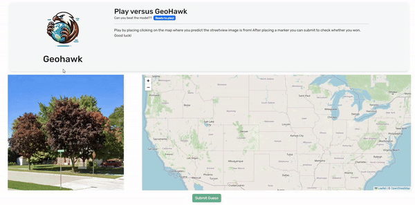

<div align="center">
  
  <h1><b>GeoHawk</b></h1>
</div>

## **Description**
GeoHawk is a web application that uses a Convolutional Neural Network (CNN) to predict the location of a Google Street View image. The model was trained on a dataset of 15,000 images from 50 different states in the USA. This repository contains notebooks for data exploration, data preparation, and model training. The repo also contains a FastAPI client that serves the model and scrapes new images so you can play against the model. This can be done through the web interface that is built with Angular.

## **Notebooks**
To see how the data was prepared and the model was made, you can check the following notebooks:

1. [Data exploration and cleansing](./notebooks/1.%20Data%20exploration%20and%20cleansing.ipynb)
2. [Modeling and evaluating CNN](./notebooks/2.%20Modeling%20and%20evaluating%20CNN.ipynb)

## **Installation**
To install the project, you need to have [Docker](https://www.docker.com) installed on your machine. After cloning this repo you can use the following command to build the project.

```bash
docker-compose up --build
```

> Navigate to `http://localhost:4200` to play against the model.
> API Docs are available at `http://localhost:8000/docs`

## **TODO**
Here are some of the things that I would like to implement in the future:

- [ ] Train the model on a larger dataset
- [ ] Implement a more complex model
- [ ] Train a new model on a panorama image dataset

## **Demonstration**
  
> A player battling against the model on the website.

## **Sources**
- [USA States shapefile](https://www.census.gov/cgi-bin/geo/shapefiles/index.php?year=2023&layergroup=States+%28and+equivalent%29)  
- [RandomStreetView](https://randomstreetview.com)
